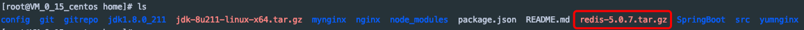

# redis与redis集群服务的安装

###### 下载文件 [redis.tar.gz官方下载](https://redis.io/download)
###### 下载客户端 [AnotherRedisDesktopManager](https://github.com/qishibo/AnotherRedisDesktopManager/releases)
## 一、redis服务的安装
### 1.环境配置
Redis是c开发的,因此安装redis需要c语言的编译环境,即需要安装gcc

查看是否安装gcc
```
gcc -v
```
如果没有gcc,则需要在线安装.命令如下
```
yum install gcc-c++
```
### 2.redis安装
1）上传redis压缩包到服务器

 

2）解压redis压缩包
```
[root@VM_0_15_centos home]# tar zxf redis-5.0.7.tar.gz
```


3)进入redis-5.0.7目录并查看该目录下文件

 

4）make编译redis源码

 
 
 如下则编译成功

 
 
5）安装编译后的redis代码到指定目录,一般存放于/usr/local下的redis目录,指令如下
```
[root@VM_0_15_centos redis-5.0.7]# make install PREFIX=/home/redis
```
如下图则说明安装成功,此时查看/home目录,可以发现多了一个redis文件夹

 
 
6）此时可以启动redis了,默认启动模式为前端启动,指令如下
```
./redis-server
```

7）前端启动的话,如果客户端关闭,redis服务也会停掉,所以需要改成后台启动redis

a）将redis解压文件里面的redis.conf文件复制到当前目录
```
[root@VM_0_15_centos bin]# cp /home/redis-5.0.7/redis.conf .
```
b）修改redis.conf文件,将daemonize no -> daemonize yes,这样便将启动方式修改为后台启动了
```
[root@VM_0_15_centos bin]# vim redis.conf
``` 
 然后保存修改并退出,指令如下(四步操作)
 ```
 Esc -> : -> wq -> Enter(回车)
```
### 3.启动redis（后台启动）
```
[root@VM_0_15_centos bin]# ./redis-server redis.conf
7911:C 10 Jan 2020 10:38:51.306 # oO0OoO0OoO0Oo Redis is starting oO0OoO0OoO0Oo
7911:C 10 Jan 2020 10:38:51.306 # Redis version=5.0.7, bits=64, commit=00000000, modified=0, pid=7911, just started
7911:C 10 Jan 2020 10:38:51.306 # Configuration loaded
```
### 4.测试
1）查看redis是否在运行
```
[root@VM_0_15_centos bin]# ps aux|grep redis
root      7912  0.0  0.2 153896  2460 ?        Ssl  10:38   0:00 ./redis-server 127.0.0.1:6379
root      8038  0.0  0.0 112708   976 pts/0    R+   10:39   0:00 grep --color=auto redis
```
2）打开redis连接
```
./redis-cli   或redis-cli -c -p 6379
```
连接成功，如下所示

```
[root@VM_0_15_centos bin]# ./redis-cli
127.0.0.1:6379> ping
PONG
```
2）打开redis客户端连接


## 二、redis集群服务安装
### 1.创建Redis集群目录
1）在usr/local目录下新建redis-cluster目录，用于存放集群节点


2）复制/usr/local/redis/bin目录下所有文件

把redis目录下的bin目录下的所有文件复制到/usr/local/redis-cluster/redis01目录下，不用担心这里没有redis01目录，会自动创建的。
```
cp -r redis/bin/ redis-cluster/redis01
```


3）删除redis01目录下快照文件dump.rdb.
```
rm -rf dump.rdb
```


4）修改redis01目录下redis.conf配置文件

a）修改端口号为6380


b）将cluster-enabled yes 的注释打开(大概632行)

c）将cluster-config-file nodes-6379.conf 的注释打开,并改为cluster-config-file nodes-6380.conf(大概640行)


d)打开bind注释，并修改为bind 192.168.0.40(这一步很重要，每个节点都要修改为对应服务器的ip，下面127.0.0.1的地方都要改为192.168.0.40)

5）创建6个redis实例

a）将redis-cluster/redis01文件复制5份到redis-cluster目录下（redis02-redis06），创建6个redis实例，模拟Redis集群的6个节点。如下所示：


b）分别修改redis.conf文件端口号为6381-6385

### 2.启动所有redis节点
1）由于一个一个启动太麻烦，所以在这里创建一个批量启动redis节点的脚本文件startall.sh，文件内容如下：
```
cd redis01
./redis-server redis.conf
cd ..
cd redis02
./redis-server redis.conf
cd ..
cd redis03
./redis-server redis.conf
cd ..
cd redis04
./redis-server redis.conf
cd ..
cd redis05
./redis-server redis.conf
cd ..
cd redis06
./redis-server redis.conf
cd ..
```


2）创建好启动脚本文件之后，需要修改该脚本的权限，使之能够执行，指令如下：
```
chmod +x startall.sh
```
3）执行startall.sh脚本，启动6个redis节点

注意：如果出现报"没有那个文件或目录行"的错误，有可能是因为文件格式错误。
输入如下命令将文件dos格式转换成unix再启动
```
dos2unix startall.sh
```


4）查看redis是否启动
```
ps -ef|grep redis
```


### 3.安装Ruby环境
注意：redis需要Ruby版本大于2.2.2

下载文件[ruby-2.3.0.tar.gz](../tools/linux/ruby-2.3.0.tar.gz)

1）若存在Ruby，则清除旧版Ruby
```
yum remove ruby
```
2）安装依赖
```
yum -y install zlib-devel curl-devel openssl-devel httpd-devel apr-devel apr-util-devel mysql-devel
```
3）上传ruby-2.3.0到服务器，并解压
```
tar zxvf ruby-2.3.0.tar.gz
```


4）进入ruby-2.3.0目录下，执行以下命令
```
./configure --disable-install-rdoc
```


5）在ruby-2.3.0目录下，执行以下命令
```
 make
```
```
 make install
```
6）查看Ruby信息
```
ruby -v
```


7）要支持redis通信，需要下载redis相关包
```
gem install redis
```


### 4.构建集群
1）切换到redis解压的源码包src目录下
```
cd /root/redis-5.0.7/src/
```
2）执行以下命令
```
./redis-trib.rb create --replicas 1 192.168.0.40:6380 192.168.0.40:6381 192.168.0.40:6382 192.168.0.40:6383 192.168.0.40:6384 192.168.0.40:6385
--replicas 1 表示每个主数据库拥有从数据库个数为1。master节点不能少于3个，所以我们用了6个redis
```


3）遇到以下提示信息，手动输入yes


### 5.测试
1）测试连接
```
./redis-cli -c -p 6380
```


2）查看集群信息
```
a.查看当前集群信息
cluster info
b.查看集群里有多少个节点
cluster nodes
```

### 6.至此linux下redis集群安装完毕


### 7.搭建多台遇到的问题
#### a 配置文件
```
redis.conf
bind 127.0.0.1 机器ip
将绑定方式修改为:
bind 机器ip
开启集群的配置
#cluster-config-file nodes-6496.conf 将注释打开并将端口号修改，区别自动生成的文件
```
#### b 端口问题
```
Redis集群端口为6491-6496 就需要打开6491-6496的端口号以及16491-16496的端口
```
#### c 重启服务
```
重启服务需要将各个端口生成的rdb、nodes.conf 、aof文件删除
```
#### d 验证
```
#./redis-cli -c -h 10.10.200.199 -p 6491
10.10.200.199:6491>cluster nodes
10.10.200.199:6491>cluster info
```
#### e 查询key
```
查看key对应的slot
cluster keyslot key
查看slot和节点的对应关系
cluster slots
```
#### f 关闭redis端口
```
./redis-cli -p 6379 shutdown
用kill -9 进程号，直接杀进程的方法会造成数据丢失
```

##后续
###1.redis-4.0.11默认会开启bind 127.0.0.1和写保护protected-mode yes,配置的时候需要将bind 127.0.0.1注释掉，改成protected-mode no